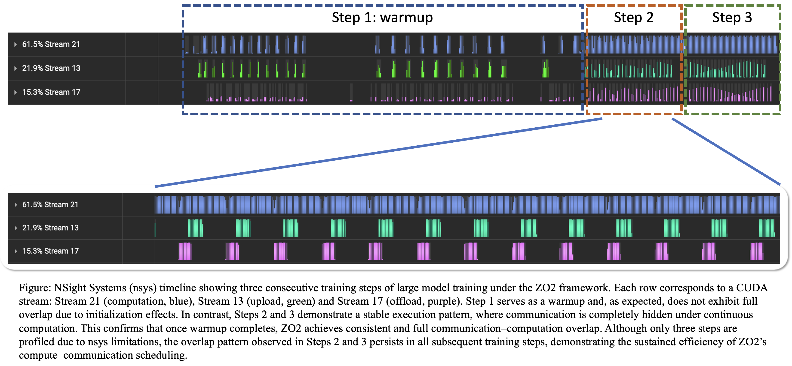

# zo2paper

All nsys report files for OPT models are stored in the [`nsys`](./nsys/) folder. For example, the analysis result for `OPT-1.3b` is shown in [`figs/opt_1.3b.png`](./figs/opt_1.3b.png) below. As illustrated, all communication, including upload (green) and offload (pink), is almost completely overlapped with computation (blue).

